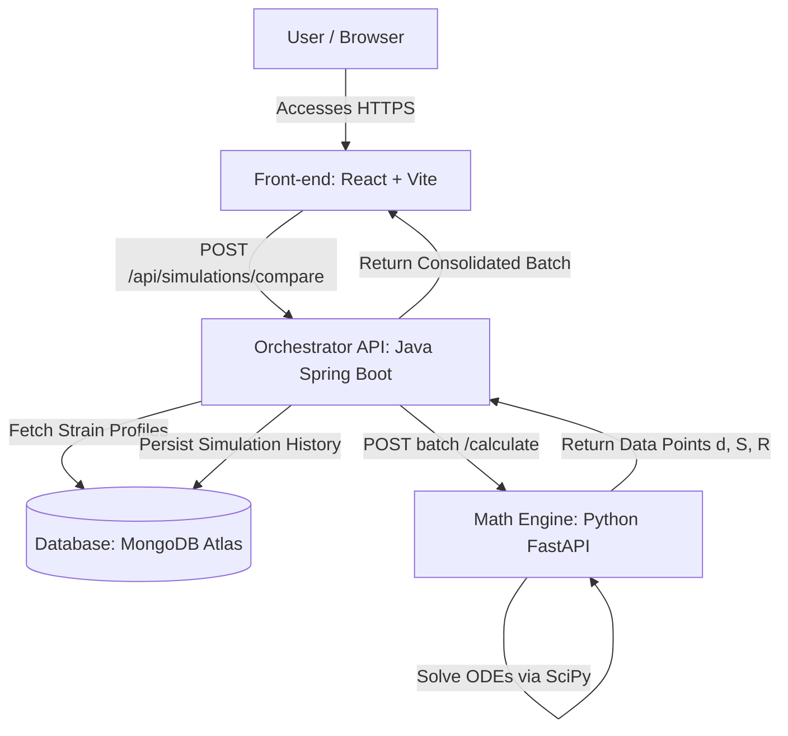

# Antimicrobial Resistance (AMR) Modeling

## Overview
This repository contains the source code, research, and documentation for the Calculus II Capstone Project at Jala University. The project focuses on the mathematical modeling of bacterial resistance to antibiotics over time, utilizing Ordinary Differential Equations (ODEs) and population dynamics models.

## Objectives
The primary goal is to simulate how susceptible bacterial populations decrease while resistant strains multiply under specific antibiotic treatments. To achieve this, the project bridges applied mathematics and software engineering through a polyglot architecture.

## Architecture & Tech Stack
The project follows a strict separation of concerns, dividing heavy mathematical processing from transactional API logic:

* **Mathematical Engine & Data Processing (Python):** Handles the ETL (Extract, Transform, Load) processes and executes the differential equation models using libraries such as `scipy` and `pandas`.
* **Core Backend API (Java / Spring Boot):** Manages simulation requests, orchestrates communication with the Python engine, and handles the application's business logic.
* **Database (MongoDB):** Provides a flexible, document-oriented schema to store unstructured raw datasets, simulation parameters, and mathematical projections.
The project is engineered following the **Microservices Architecture Pattern**, ensuring strict separation of concerns, high scalability, and seamless portability across environments.


### Architectural Layer Breakdown

* **Front-end (React + Vite + Tailwind CSS + Recharts):** Renders the glassmorphism HUD, processes high-precision responsive charts with decimal tooltips, manages user UI state, and consumes the Spring Boot backend gateway.
* **Back-end Orchestrator (Java 21 + Spring Boot + Spring Data MongoDB):** Executes the core business logic, handles the repository CRUD operations for pathogen records, persists historical multi-scenario simulation logs, and orchestrates async batch requests to the Python microservice.
* **Mathematical Engine (Python 3.11+ + FastAPI + SciPy + NumPy):** A specialized, high-performance API strictly isolated and optimized for solving non-linear systems of Ordinary Differential Equations (ODEs) using advanced scientific computing modules.
* **Database (MongoDB Atlas NoSQL):** Persists unstructured static biological parameters and historical document logs of multi-scenario batch simulations.

---

## Mathematical Foundation (ODE Model)

The simulation core solves a non-linear system of non-homogeneous **Ordinary Differential Equations (ODEs)**. The mathematical framework adapts Verhulst's Logistic Growth Model to represent resource-limited competition between two bacterial biotypes under selective drug-induced mortality.

The computational engine numerically integrates the following system over time (t):

1. **Susceptible Population Dynamics (S)**
   dS/dt = r · S · (1 - (S + R)/K) - a · S - m · S

2. **Resistant Population Dynamics (R)**
   dR/dt = r · R · (1 - (S + R)/K) + m · S

### Parameter Specification

* **S(t) (Susceptible Biomass):** State variable representing the concentration of Colony Forming Units (CFU/mL) vulnerable to the drug.
* **R(t) (Resistant Biomass):** State variable representing mutated, drug-resistant CFU/mL.
* **r (Intrinsic Growth Rate):** Cellular division speed of the strain inside an optimal biological medium.
* **K (Carrying Capacity):** Environmental threshold limiting growth due to nutrient depletion or spatial constraints (defined at 10,000,000 CFU/mL).
* **a (Antibiotic Efficacy):** Clearance/mortality rate imposed by the antimicrobial agent acting **strictly upon the susceptible population (S)**.
* **m (Base Mutation Rate):** The probability of genetic transition from S to R during a cell division event (acting as a mass conservation link between both equations).

**Computational Solver:** Numerical integration is executed via SciPy's `odeint` algorithm, utilizing 10 integration steps per day to generate highly smooth lines and fractional data points.

---
## Data Sources
The mathematical models are grounded in real-world Antimicrobial Resistance (AMR) datasets sourced from:
* Centers for Disease Control and Prevention (CDC)
* World Health Organization (WHO)
* Kaggle (Open-source AMR datasets)

---

## How to Run (Local Deployment via Docker)

This project is fully containerized. Running it via Docker is the recommended approach for evaluation, as it abstracts away manual installations of the JDK, Python, Node, and MongoDB.

### Prerequisites
* Git installed.
* [Docker Desktop](https://www.docker.com/products/docker-desktop/) installed and running.

### Step-by-Step Guide

1. Clone the repository:
   ```bash
   git clone <YOUR_REPOSITORY_URL>
   cd amr-dynamics-core
   ```

2. Spin up the entire ecosystem using Docker Compose:
   ```bash
   docker compose up -d --build
   ```
   *(Note: This command will download base images, compile the Java code, install Python/Node dependencies, and set up the virtual network. It may take a few minutes on the first run).*

3. Access the application in your browser:
   * **Front-end Dashboard:** http://localhost:3000
   * *(Optional) Java API Swagger UI:* http://localhost:8080/swagger-ui.html
   * *(Optional) Python Engine Docs:* http://localhost:8000/docs

---

## Development & Version Control

To ensure a clean and secure repository (preventing the upload of heavy dependencies like `node_modules`, `target/`, or `__pycache__`), this project utilizes strict `.gitignore` files within each microservice directory. 

**For Safe Commits:**
If you are contributing to the codebase, ensure you **do not remove** the `.gitignore` files from the root folders of each service before running `git add .`.

---

## Development Team

* **Rodrigo Vieira** - [GitHub](https://github.com/Rodrigo-Avieira) / [LinkedIn](www.linkedin.com/in/rodrigo-vieira-8a89211b2)


## 📄 License

This project is licensed under the [MIT License](LICENSE).
